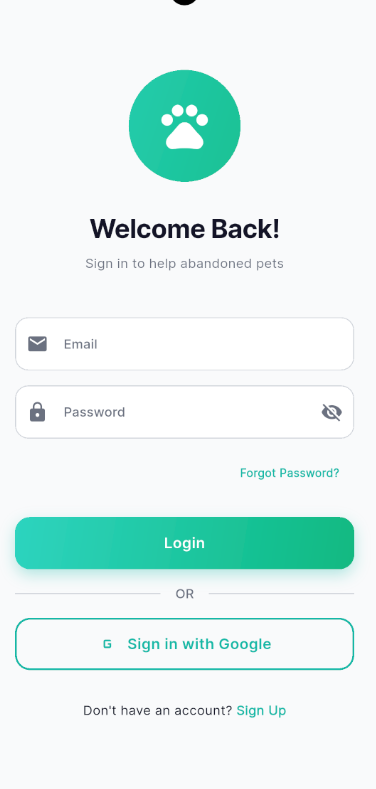
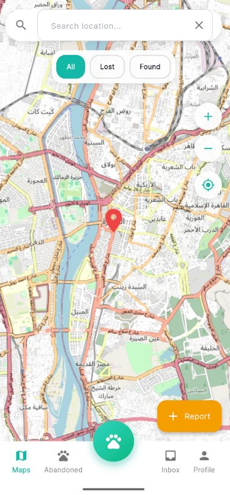
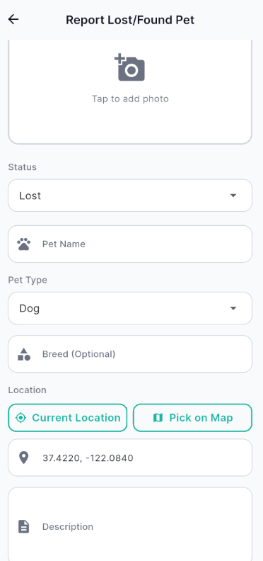
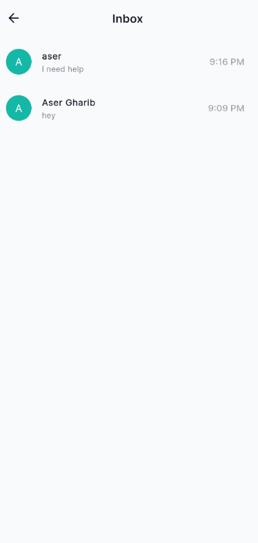
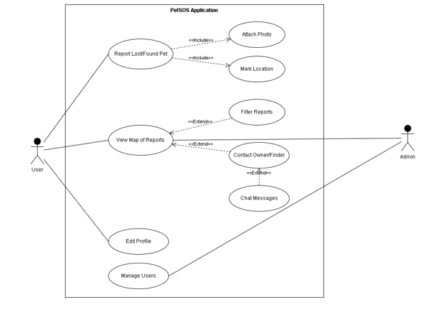

# PetSOS: Lost and Found Pet Rescue App (Flutter + Firebase)

Cross-platform Flutter application that replaces lost-pet posters with a live community map: geolocated photo reports, private in-app messaging between finders and owners, and an admin dashboard. Built with MVVM.

## App walkthrough (screenshots from the running app)

| Login | Rescue map | Report a pet | Inbox |
|---|---|---|---|
|  |  |  |  |

**Authentication.** Email/password sign-up and login plus Google Sign-In through Firebase Authentication, with password visibility toggle, forgot-password flow, and full form validation (`utils/app_validators.dart`, covered by unit tests).

**Rescue map.** A live OpenStreetMap view (`flutter_map`) centered on the user via `geolocator`, showing every report as a pin. Filter chips switch between All, Lost, and Found, a search bar jumps to locations, and a floating Report button starts a new report. The `RoutingService` draws the route from the user to a selected pet.

**Reporting a pet.** Photo capture or gallery upload (`image_picker`), Lost/Found status, pet name, type, and optional breed, then location set either from GPS ("Current Location") or by dropping a pin on a dedicated picker screen ("Pick on Map"). Images upload to Firebase Storage, metadata goes to Cloud Firestore.

**Messaging.** Tapping a report lets the finder and owner chat privately inside the app (Inbox and Chat screens backed by `ChatService` on Firestore), so no one has to share a phone number.

**Admin dashboard.** Separate admin flow with Users and Pets tabs for moderating reports and managing accounts.

**Also inside:** pet detail screen, abandoned-pets browsing tab, profile and settings screens, light/dark theme (`ThemeViewModel`), and localization via `easy_localization`.

## System design



Use-case model from the project report: users report pets (attach photo, mark location), browse and filter the map, contact the owner/finder through chat, and edit their profile, while admins additionally manage users.

## Architecture (MVVM with Provider)

```
lib/
  models/            data entities: Pet, User, Message
    data/
      repositories/  pets_repository, user_repository (Firestore access)
      services/      chat, location, routing, storage
  viewmodels/        auth, map, pets, chat, location, navigation, theme
  views/screens/     auth, map, report, pet_detail, inbox, chat, abandoned,
                     profile, settings, admin (users tab, pets tab)
  utils/             app_validators
```

State flows one way: views watch ViewModels through `Provider`, ViewModels call repositories/services, and those wrap Firebase. Firebase App Check is enabled for backend protection.

## Testing

Four suites with `flutter_test` and `mockito` (generated mocks included): model serialization (`pet_test`), form validators (`validator_test`, 8 cases), and mocked ViewModel behavior for the map and pets flows.

```bash
flutter test
```

## Getting started

```bash
flutter pub get
dart pub global activate flutterfire_cli
flutterfire configure   # generates firebase_options.dart (kept out of the repo on purpose)
flutter run
```

Requires a Firebase project with Authentication (Email + Google), Cloud Firestore, and Storage enabled.
